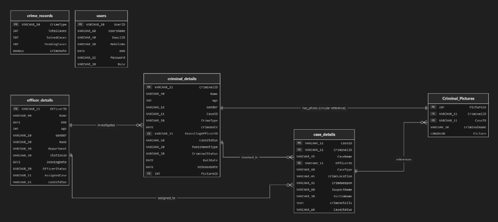

# 🚨 Crime Record Management System (CRMS) - v103

```text
  _____  _____   __  __  _____ 
 / ____||  __ \ |  \/  |/ ____|
| |     | |__) || \  / || (___  
| |     |  _  / | |\/| | \___ \ 
| |____ | | \ \ | |  | | ____) |
 \_____||_|  \_\|_|  |_||_____/ 
  POLICE RECORD & COMPLAINT PORTAL
```

Welcome to the **Crime Record Management System (CRMS)**—a highly structured, modular Java CLI application designed to bridge the gap between citizens and law enforcement. CRMS empowers citizens to file complaints while giving officers a centralized, secure terminal to track investigations, manage criminal dossiers, roster personnel, and generate official documents.

---

## ⚡ Key Highlights & Architecture

### 🛡️ Offline-First Resilience (Fail-Safe Mechanism)

```text
                +---------------------------------------+
                |         CRMS Application Boot         |
                +---------------------------------------+
                                    |
                                    v
                     [ Attempt JDBC MySQL Connect ]
                                    |
                  +-----------------+-----------------+
                  | Connected                         | Failed (Offline)
                  v                                   v
        +-------------------+               +-------------------+
        |    ONLINE MODE    |               |   OFFLINE MODE    |
        |  Live Relational  |               |  In-Memory / File |
        |   MySQL Database  |               |    Simulation     |
        +-------------------+               +-------------------+
```

* **Offline Fallback**: If connection to the MySQL database fails (e.g., XAMPP server is down), the application seamlessly transitions to **Offline Mode**.
* **Automatic Recovery**: A background synchronization thread checks the database heartbeat every 60 seconds, offering the user a safe path to transition back to the live database once the connection is restored.
* **Text Report Exporter**: Users can export operational records (Cases, Officer Rosters, Criminal Profiles) directly into formatted local text databases (`CasesData.txt`, `OfficerData.txt`) for immediate physical printing.

---

## 🚀 Feature Showcase

### 🔒 Secure Role-Based Authentication
* **Citizen Portal**: Open registration for the public to file First Information Reports (FIR) and look up case progress.
* **Officer & Admin Dashboard**: Strict verification required to access police rosters, add criminal records, assign cases, or modify system databases.

### 📝 Smart FIR Report Generator
When an FIR is filed, the system extracts the victim, suspect, crime details, and the logged-in officer’s metadata, generating a structured, ready-to-print official document:
📂 `FIR_Report_<Date>_<CaseID>.txt`

### 📊 Real-Time Crime Analytics
An automated analytics suite that tracks total cases vs. solved vs. pending, and dynamically calculates the **Crime Rate/Ratio** across different classifications (Accidents, Cyber Crime, Robbery, Terror incidents, etc.).

---

## 📅 Roadmap & The Computer Science Behind It (Work in Progress)

We are actively expanding CRMS. In the next release, we are replacing the standard array structures with custom, low-level **Data Structures & Algorithms (DSA)** and introducing **Multi-threaded Background Daemons**:

### 🧠 1. Custom DSA Implementation
* **Why Doubly Linked List (DLL)?**
  * Used for navigating through criminal histories sequentially (Next/Previous offense) with \(O(1)\) node insertion and deletion.
* **Why Priority Queue?**
  * *Because a murder investigation shouldn't wait behind a traffic parking fine!* The Priority Queue will sort pending cases by crime severity, routing critical investigations to the top of the roster automatically.
* **Why Stack?**
  * Implements a history stack so officers can navigate the multi-tier menu system or undo/redo edits to case logs.
* **Why Queue?**
  * Implements a FIFO (First-In, First-Out) pipeline to process citizen complaint registrations in the order they are received.

### 🧵 2. Multi-threaded Background Workers
* **JDBC Sync Daemon**: Runs in the background, polling database connection status every minute to switch modes dynamically without interrupting active CLI menus.
* **Logging Engine Daemon**: Runs on a separate thread to write transaction audits and activity histories asynchronously, ensuring the main interface remains latency-free.

### 📝 3. Immutable Activity History Logs
* An append-only log file system tracking user IDs, actions, and exact timestamps (e.g., `[2026-08-16 00:04:58][OFFICER-403] updated CASE-7645 status to 'Solved'`) to prevent unauthorized modifications and provide full auditability.

---

## 📂 Project Directory Structure

Here is how all the classes are organized inside the `src` package:

```text
src/
├── DataBase/                   # Database configuration, creation, and seeding
│   ├── CreateTable.java
│   ├── Database.java
│   ├── DataFound.java
│   ├── InsertData.java
│   └── Validation.java
├── DataStructure/              # Files and reports exporter
│   └── IOFiles.java
├── Layout/                     # CLI navigation pages and user menus
│   ├── CRMngr.java
│   ├── CrimeMngr.java
│   ├── DIG.java
│   ├── Dashboard.java
│   └── Investigation.java
├── Profile/                    # User registration and identity modules
│   ├── Login_SignUpPage.java
│   └── User.java
├── Quries/                     # Raw SQL statement execution layers
│   ├── CRMngrQueries.java
│   ├── CrimeMngrQueries.java
│   ├── DIGQueries.java
│   ├── IAQueries.java
│   ├── Login_SignUp_Queries.java
│   ├── OODataQueries.java
│   └── UserQuries.java
└── Main.java
```

---

## 🗄️ Database Schema & Relational Model

Below is the database relationship schema mapping the tables and connections:



### 📊 Tables Overview

> [!NOTE]  
> **Database Tables Overview**  
> * **`users`**: Manages user authentication, contact details, and role classifications (e.g., `Citizen`, `Officer`, `Admin`).  
> * **`officer_details`**: Tracks active duty officers, their departments, ranks, joining dates, assigned cases, and workload statuses.  
> * **`criminal_details`**: Profiles registered criminal records, tracking their age, crime classifications, investigating officers, and bail/release status.  
> * **`case_details`**: The logbook of all filed FIR reports, detailing crime descriptions, weapon types, locations, victims, and progress status.  
> * **`Criminal_Pictures`**: Stores physical identification records and binary payloads (`LONGBLOB`) of criminal mugshots.  
> * **`crime_records`**: Synthesizes real-time crime rate statistics (total, solved, and pending cases) per category.

### 🔗 Key Mappings & Constraints

> [!NOTE]  
> **`criminal_details` ──> `officer_details`**  
> The `InvestingOfficerID` column (FK) references `officer_details(OfficerID)`. This ensures only valid registered officers can be assigned to lead a criminal investigation.

> [!NOTE]  
> **`case_details` ──> `criminal_details` & `officer_details`**  
> * The `CriminalID` column (FK) references `criminal_details(CriminalID)`.
> * The `OfficerID` column (FK) references `officer_details(OfficerID)`.

> [!NOTE]  
> **`Criminal_Pictures` ──> `criminal_details` & `case_details`**  
> * The `CriminalID` column (FK) references `criminal_details(CriminalID)`.
> * The `CaseID` column (FK) references `case_details(CaseID)`.

> [!IMPORTANT]  
> **🔄 Circular Constraint (`criminal_details` ──> `Criminal_Pictures`)**  
> The `criminal_details(PictureID)` (FK) references `Criminal_Pictures(PictureID)`. To resolve insertion dependencies (since a picture belongs to a criminal, but a criminal links to a picture), the circular constraint is applied dynamically via the `ApplyCircularFKs()` method after both tables are created.

---

## ⚙️ Configuration & Installation

### 1. Database Setup
1. Launch **XAMPP / WAMP** and start the **MySQL** module.
2. Open phpMyAdmin and create a database named `crms`.
   ```sql
   CREATE DATABASE crms;
   ```
3. The system automatically initializes the database tables and inserts default seed data on its first run.
4. *Default DB Credentials:*
   * **URL**: `jdbc:mysql://localhost:3306/crms`
   * **User**: `root`
   * **Password**: `[Empty]` *(You can change this in `src/DataBase/Database.java` if needed)*

### 2. Classpath Configuration
Ensure that the MySQL Connector/J driver (`mysql-connector-j-9.3.0.jar`) is added to your project dependencies or classpath:
* **IntelliJ**: Go to `File -> Project Structure -> Libraries` and add the downloaded Jar.
* **CLI Execution**: Reference the jar path via the `-cp` option when compiling and running.

---

## 🏃 Running the Application

### Option A: Via Terminal / Command Prompt
Navigate to the root directory `v103` and execute:
```bash
# Compile
javac -cp "path/to/mysql-connector-j-9.3.0.jar" src/Main.java -d out

# Run
java -cp "out;path/to/mysql-connector-j-9.3.0.jar" CRMS
```

### Option B: Via IntelliJ IDEA
1. Open the folder `v103` as an IntelliJ project.
2. Confirm the module SDK is set to Java 8 or above.
3. Verify that the library dependency path for `mysql-connector-j` is correctly resolved.
4. Run `Main.java`.

---

## 📜 License

This project is open-source, licensed under the [MIT License](LICENSE).
