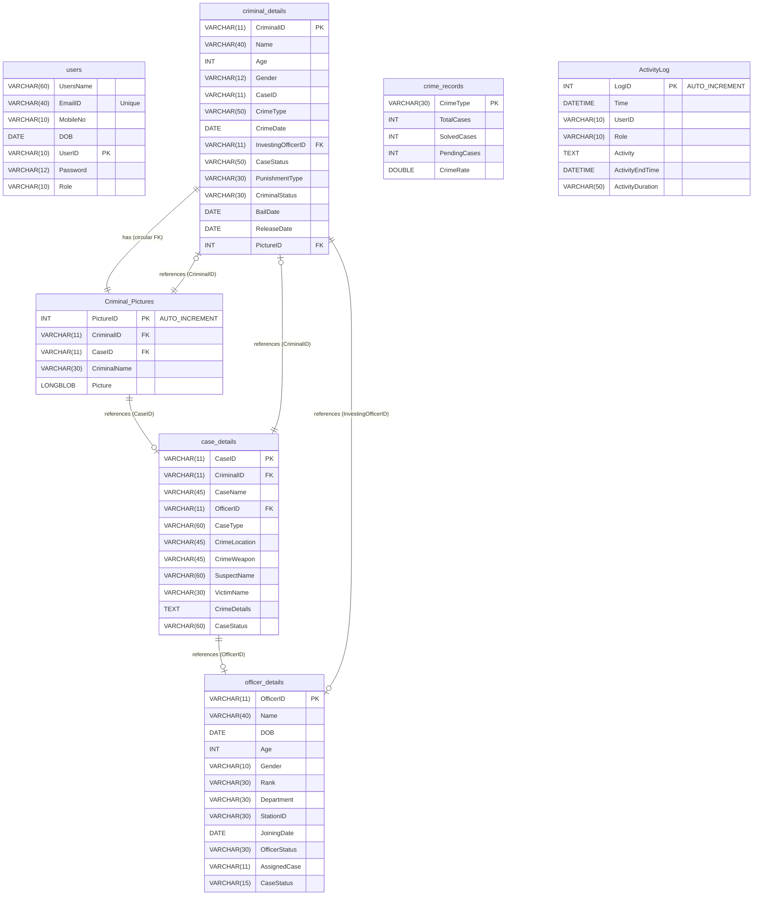

# 🚨 Crime Record Management System (CRMS) - v103

[](https://opensource.org/licenses/Apache-2.0)

```text
  _____  _____   __  __  _____ 
 / ____||  __ \ |  \/  |/ ____|
| |     | |__) || \  / || (___  
| |     |  _  / | |\/| | \___ \ 
| |____ | | \ \ | |  | | ____) |
 \_____||_|  \_\|_|  |_||_____/ 
  POLICE RECORD & COMPLAINT PORTAL
```

> 🚨 **A robust, high-performance Crime Record Management System (CRMS) built in Java. Engineered with role-based security, JDBC connection resilience (online/offline fail-safe mode), and real-time analytics. Powered by custom low-level Data Structures (Priority Queues, DLLs, BSTs) & background daemon threads for extreme execution speed! 💻⚡**

Welcome to the **Crime Record Management System (CRMS)**—a highly structured, modular Java CLI application designed to bridge the gap between citizens and law enforcement. CRMS empowers citizens to file complaints while giving officers a centralized, secure terminal to track investigations, manage criminal dossiers, roster personnel, and generate official documents.

---

## ⚡ Key Highlights & Architecture

### 🛡️ Offline-First Resilience (Fail-Safe Mechanism)

```text
                +---------------------------------------+
                |         CRMS Application Boot         |
                +---------------------------------------+
                                    |
                                    v
                     [ Attempt JDBC MySQL Connect ]
                                    |
                  +-----------------+-----------------+
                  | Connected                         | Failed (Offline)
                  v                                   v
        +-------------------+               +-------------------+
        |    ONLINE MODE    |               |   OFFLINE MODE    |
        |  Live Relational  |               |  In-Memory / File |
        |   MySQL Database  |               |    Simulation     |
        +-------------------+               +-------------------+
```

* **Offline Fallback**: If connection to the MySQL database fails (e.g., XAMPP server is down), the application seamlessly transitions to **Offline Mode**.
* **Automatic Recovery**: A background synchronization thread checks the database heartbeat every 60 seconds, offering the user a safe path to transition back to the live database once the connection is restored.
* **Text Report Exporter**: Users can export operational records (Cases, Officer Rosters, Criminal Profiles) directly into formatted local text databases (`CasesData.txt`, `OfficerData.txt`) for immediate physical printing.

---

## 🚀 Feature Showcase

### 🔒 Two-Step Security & Role-Based Access Control (RBAC)
* **Citizen Portal**: Open registration for the public to file First Information Reports (FIR) and look up case progress.
* **Officer & DGP Dashboard**: Strict role-based verification up to the Director General of Police (DGP) level to access police rosters, add criminal records, assign cases, or modify system databases.
* **Two-Step Authentication**:
  * **Citizen Login**: Prompts and verifies a dynamic 30-second expiring CAPTCHA challenge before granting access.
  * **Officer/DGP Login**: Authenticates credentials, restricts access to accounts with `Admin` or `Officer` roles, and verifies a simulated One-Time Password (OTP) challenge.
* **Time-Bound CAPTCHA Challenge**: Protects administrative endpoints with a dynamic, multi-threaded alphanumeric CAPTCHA that automatically expires after 30 seconds.

### 📝 Smart FIR Report Generator
When an FIR is filed, the system extracts the victim, suspect, crime details, and the logged-in officer’s metadata, generating a structured, ready-to-print official document:
📂 `FIR_Report_<Date>_<CaseID>.txt`

### 📊 Real-Time Crime Analytics
An automated analytics suite that tracks total cases vs. solved vs. pending, and dynamically calculates the **Crime Rate/Ratio** across different classifications (Accidents, Cyber Crime, Robbery, Terror incidents, etc.).

---

## 💻 Java Concepts Utilized in CRMS

This codebase demonstrates key core and advanced Java software engineering principles:

1. **Object-Oriented Programming (OOP)**:
   * **Inheritance**: Used for extending class functionalities (e.g., `DGP extends DGPQueries` for database-backed controller logic, and custom exceptions like `AuthorizationException extends Exception`).
   * **Encapsulation**: Session tracking variables (`LoggedUserID`, `LoggedUserRole`) are kept private and accessed only through strict getters and setters.
2. **Multi-threading & Asynchronous Tasks**:
   * **Daemon Heartbeat Thread**: The DB connection sync process runs as a daemon thread in the background (`DB.setDaemon(true)`), checking database availability every 10 seconds.
   * **Non-Blocking Timer Threads**: Alphanumeric CAPTCHAs and OTP codes spawn isolated background threads (`InputReader`) to implement a 30-second expiry timeout without blocking the console indefinitely.
3. **JDBC API & Transaction Security**:
   * Used for relational database connectivity with MySQL using `PreparedStatement` (preventing SQL injection), transaction safety, and dynamic creation of circular foreign keys.
4. **Custom Exception Handling**:
   * Designed custom checked exceptions (such as `DBConnectionException` and `AuthorizationException`) to manage connection fallbacks and role authorization violations cleanly.
5. **File I/O Streams**:
   * Implemented persistent local logging and report generation using file writers to export physical case files and system configurations when operating in offline fallback mode.

---

## 🧠 Custom DSA Implementation

To optimize performance and minimize database query overhead, CRMS integrates custom low-level **Data Structures & Algorithms (DSA)** alongside database storage:

* **Custom Doubly Linked List (DLL)** (`CustomDoublyLinkList.java`): Used for navigating through criminal histories sequentially (Next/Previous offense) with \(O(1)\) node insertion and deletion.
* **Custom Priority Queue** (`CustomPriorityQueue.java`): Prioritizes pending cases by crime severity, automatically routing critical investigations to the top of the roster.
* **Custom Binary Search Tree (BST)** (`CustomBinarySearchTree.java`): Speeds up case searches by indexing case details by their primary keys, allowing \(O(\log n)\) lookup time.
* **Custom Stack** (`CustomStack.java`): Implements a history stack so officers can navigate the multi-tier menu system or undo/redo edits to case logs.
* **Custom Queue** (`CustomQueue.java`): Implements a FIFO (First-In, First-Out) pipeline to process citizen complaint registrations in the order they are received.

---

## 📂 Project Directory Structure

```text
CRMSv103/
├── .idea/                 # IntelliJ IDEA configuration files
├── src/                   # Source directory for the Java application
│   ├── APIs/              # Security and Helper APIs (Captcha, OTP, TimeStamp, custom exceptions)
│   │   ├── AuthorizationException.java
│   │   ├── Captcha.java
│   │   ├── DBConnectionException.java
│   │   ├── OTP.java
│   │   └── TimeStamp.java
│   ├── DataBase/          # Database configuration, connection management, schema validation & data seeding
│   │   ├── CreateTable.java
│   │   ├── Database.java
│   │   ├── DataFound.java
│   │   ├── InsertData.java
│   │   ├── routines.sql       # Database SQL routines (functions and stored procedures)
│   │   ├── table_relation_schema.png # Database relationship schema diagram
│   │   └── Validation.java
│   ├── DataStructure/     # Custom Data Structures & algorithms for in-memory processing
│   │   ├── CustomBinarySearchTree.java
│   │   ├── CustomDoublyLinkList.java
│   │   ├── CustomPriorityQueue.java
│   │   ├── CustomQueue.java
│   │   ├── CustomStack.java
│   │   ├── DataStructure.java
│   │   └── IOFiles.java
│   ├── Layout/            # Command Line Interface (CLI) menus & user layouts
│   │   ├── CrimeMngr.java
│   │   ├── CRMngr.java
│   │   ├── DGP.java
│   │   ├── Dashboard.java
│   │   └── Investigation.java
│   ├── Profile/           # User authentication and profile settings
│   │   ├── Login_SignUpPage.java
│   │   └── User.java
│   ├── Quries/            # Raw SQL Query execution files for database operations
│   │   ├── CRMngrQueries.java
│   │   ├── CrimeMngrQueries.java
│   │   ├── DGPQueries.java
│   │   ├── IAQueries.java
│   │   ├── Login_SignUp_Queries.java
│   │   ├── OODataQueries.java
│   │   └── UserQuries.java
│   └── Main.java
├── CasesData.txt          # Active exported database
├── OfficerData.txt        # Active officer roster export
├── LICENSE                # Apache 2.0 License Agreement
├── NOTICE                 # Attribution and copyright notice
├── README.md              # Documentation
└── CRMSv103.iml           # IntelliJ module file
```

---

## 🗄️ Relational Database Schema (Mermaid ER Diagram)

Below is the code-based entity-relationship (ER) diagram mapping all database tables, columns, and relationships:



---

## 📊 Tables Overview

> [!NOTE]  
> **Database Tables Overview**  
> * **`users`**: Manages user authentication, contact details, and role classifications (e.g., `Citizen`, `Officer`, `Admin`).  
> * **`officer_details`**: Tracks active duty officers, their departments, ranks, joining dates, assigned cases, and workload statuses.  
> * **`criminal_details`**: Profiles registered criminal records, tracking their age, crime classifications, investigating officers, and bail/release status.  
> * **`case_details`**: The logbook of all filed FIR reports, detailing crime descriptions, weapon types, locations, victims, and progress status.  
> * **`Criminal_Pictures`**: Stores physical identification records and binary payloads (`LONGBLOB`) of criminal mugshots.  
> * **`crime_records`**: Synthesizes real-time crime rate statistics (total, solved, and pending cases) per category.
> * **`ActivityLog`**: Stores the chronological system events, audits, and user actions for monitoring and session timing.

> [!NOTE]  
> **`ActivityLog` Schema**  
> * **`LogID`** (`INT PRIMARY KEY AUTO_INCREMENT`): Unique identifier for each log entry.  
> * **`Time`** (`DATETIME`): The exact timestamp when the activity started.  
> * **`UserID`** (`VARCHAR(10)`): The identifier of the user performing the action.  
> * **`Role`** (`VARCHAR(10)`): The role of the logged user (`Citizen`, `Officer`, `Admin`).  
> * **`Activity`** (`TEXT`): Description of the action performed (e.g., "Filed FIR report", "Logged out").  
> * **`ActivityEndTime`** (`DATETIME`): The exact timestamp when the action ended.  
> * **`ActivityDuration`** (`VARCHAR(50)`): Human-readable duration spent during the user's session action.

### 🔗 Key Mappings & Constraints

> [!NOTE]  
> **`criminal_details` ──> `officer_details`**  
> The `InvestingOfficerID` column (FK) references `officer_details(OfficerID)`. This ensures only valid registered officers can be assigned to lead a criminal investigation.

> [!NOTE]  
> **`case_details` ──> `criminal_details` & `officer_details`**  
> * The `CriminalID` column (FK) references `criminal_details(CriminalID)`.
> * The `OfficerID` column (FK) references `officer_details(OfficerID)`.

> [!NOTE]  
> **`Criminal_Pictures` ──> `criminal_details` & `case_details`**  
> * The `CriminalID` column (FK) references `criminal_details(CriminalID)`.
> * The `CaseID` column (FK) references `case_details(CaseID)`.

> [!IMPORTANT]  
> **🔄 Circular Constraint (`criminal_details` ──> `Criminal_Pictures`)**  
> The `criminal_details(PictureID)` (FK) references `Criminal_Pictures(PictureID)`. To resolve insertion dependencies (since a picture belongs to a criminal, but a criminal links to a picture), the circular constraint is applied dynamically via the `ApplyCircularFKs()` method after both tables are created.

---

## ⚙️ Configuration & Installation

### 1. Database Setup
1. Launch **XAMPP / WAMP** and start the **MySQL** module.
2. Open phpMyAdmin and create a database named `crms`.
   ```sql
   CREATE DATABASE crms;
   ```
3. The system automatically initializes the database tables and inserts default seed data on its first run.
4. *Default DB Credentials:*
   * **URL**: `jdbc:mysql://localhost:3306/crms`
   * **User**: `root`
   * **Password**: `[Empty]` *(You can change this in `src/DataBase/Database.java` if needed)*
5. **Import SQL Functions/Routines**:
   To import the custom database functions (for column details and officer verification):
   * **Via phpMyAdmin**: Select the `crms` database -> Go to the **Import** tab -> Choose `src/DataBase/routines.sql` -> Click **Import** (or **Go**).
   * **Via Command Line**: Run the following command:
     ```bash
     mysql -u root crms < src/DataBase/routines.sql
     ```

### 2. Classpath Configuration
Ensure that the MySQL Connector/J driver (`mysql-connector-j-9.3.0.jar`) is added to your project dependencies or classpath:
* **IntelliJ**: Go to `File -> Project Structure -> Libraries` and add the downloaded Jar.
* **CLI Execution**: Reference the jar path via the `-cp` option when compiling and running.

---

## 🏃 Running the Application

### Option A: Via Terminal / Command Prompt
Navigate to the root directory `CRMSv103` and execute:
```bash
# Compile
javac -cp "path/to/mysql-connector-j-9.3.0.jar" src/Main.java -d out

# Run
java -cp "out;path/to/mysql-connector-j-9.3.0.jar" CRMS
```

### Option B: Via IntelliJ IDEA
1. Open the folder `CRMSv103` as an IntelliJ project.
2. Confirm the module SDK is set to Java 8 or above.
3. Verify that the library dependency path for `mysql-connector-j` is correctly resolved.
4. Run `Main.java`.

---

## 📄 License

This project is licensed under the **Apache License 2.0**. See the [LICENSE](LICENSE) file for details.

Copyright © 2026 MR. ADITYA PARMAR. All rights reserved.
